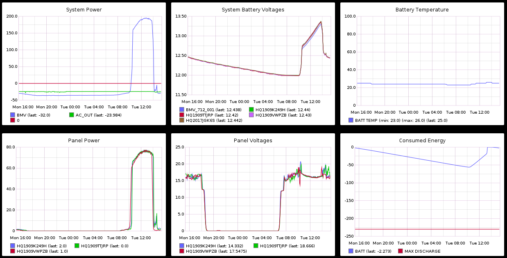
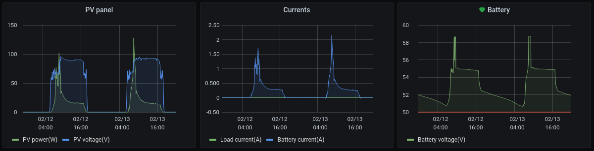

# velog

## Description

VE.Direct serial data stream parser. Use this utility to parse and log data
from your Victron Energy devices to:
- csv file
- Graphite's carbon database
- Prometheus exporter

## Dependencies

General:
```bash
sudo apt install build-essential automake libcunit1-dev
```

For Prometheus exporter:
```bash
sudo apt install libmicrohttpd-dev
```
and
```bash
libprom-dev
libpromhttp-dev
```
available [here](https://github.com/digitalocean/prometheus-client-c)


## Compiling

General (csv and Graphite support):
```bash
$ ./autogen.sh
$ ./configure
$ make
```

Compile with Prometheus support:

```bash
$ ./autogen.sh
$ ./configure --enable-prometheus
$ make
```

## Usage

```bash
velog -i /dev/serial/by-id/usb-VE_Direct_cable-port0 -o log.csv -r 1
```


```text
-i [Serial device]
-o [Logfile name]
-r [Log rotate interval in days]
-g [send to graphite host]
-d [graphite device id]
-p [Export to Prometheus (default port 9110)]
-e [Port for Prometheus exporter]
```

## Contrib

Graphite example:

see `contrib/graphite/` for example graphing setup logging data to carbon-cache and graphing with
graphite on raspberry pi.



Prometheus example:

see `contrib/prometheus/` for Prometheus configuration





## Licence

GPL Version 3

See `COPYING` for details
