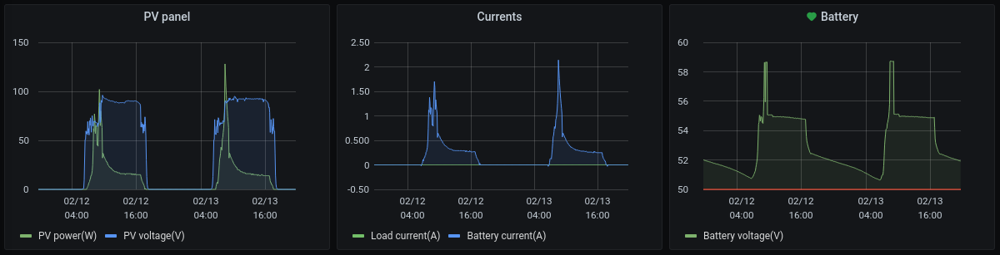

## Prometheus configuration for exporting with velog

Add the following in your Prometheus config file, `prometheus.yml`, under the section `scrape_configs:`
Adjust the port to match velog. Adjust ip if scraping from another machine.

```text
  - job_name: velog
    static_configs:
      - targets: ['localhost:9110']
```

After restarting Prometheus, the velog data is available in the format:

`velog_gauge{label="VE-DIRECT VALUE"}`

As an example below the MPPT devices supply the following parameters:

```text
velog_gauge{label="V"}
velog_gauge{label="PPV"}
velog_gauge{label="VPV"}
velog_gauge{label="IL"}
velog_gauge{label="I"}
```
Below is a graph example from Grafana:


